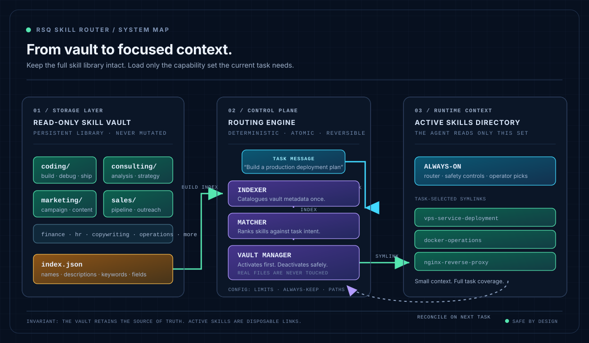

# RSQ Skill Router

**Intelligent skill loading for AI agents.**

> Keep the whole library. Load only the skills the current task needs.

Skills are cheap to collect and expensive to leave loaded forever.

A single serious agent user can accumulate **80–100 skills** over time. A fleet can carry **600–700** across its agents and fields. Many runtimes place every installed skill's name and description into the initial context. At 100 skills, that can cost roughly **8,000–12,000 tokens** before the agent receives its first task. At 600–700 skills, it becomes **60,000+ tokens** of startup context.

The exact number depends on the runtime and the size of each skill description. The problem is still linear: every useful skill makes every unrelated task more expensive.

RSQ Skill Router keeps the full library in a vault, indexes it locally, and exposes a small task-selected set through symlinks. The agent sees the active directory. The library stays available without staying loaded.



## Install

### Recommended: bootstrap installer

```bash
curl -sSL https://raw.githubusercontent.com/RED-NTWRK/RSR/main/install.sh | bash
```

The bootstrap installer:

1. clones RSR to `~/.rsq-skill-router/`
2. creates the `skill-router` command in `~/.local/bin/`
3. detects your agent and its skills directory
4. lets you choose skills that must stay active
5. moves the rest of the library into a vault and builds the first index

It needs Python 3.10+, Git, and repository access while RSR remains private.

### Alternative: install from source

```bash
git clone https://github.com/RED-NTWRK/RSR.git ~/.rsq-skill-router
cd ~/.rsq-skill-router
python3 -m pip install .
skill-router install
```

## What changes after install

The router splits the library into two locations:

| Location | Purpose |
|---|---|
| **Vault** | Every routable skill. This is the source library. |
| **Active directory** | The small set your agent can load for the current task. |

The installer makes the first move from active directory to vault. After that, routing only creates or removes symlinks in the active directory.


## Use it

The core workflow has three commands:

```bash
# Inspect the current library and active set
skill-router status

# See matches without touching the filesystem
skill-router route "write a cold email sequence for enterprise prospects"

# Match the task, activate the new set, remove stale links
skill-router reconcile "write a cold email sequence for enterprise prospects"
```

If the router has no index yet, build one first:

```bash
skill-router index
```

A typical route result looks like this:

```text
Top field: sales
Found in: sales, copywriting
Skills: 5

  [sales]
    0.872  cold-email
    0.741  outbound-engine

  [copywriting]
    0.795  email-writing-frameworks
    0.712  subject-lines
```

Scores and names come from your own vault. The router never needs a remote API call to produce them.

## Make routing automatic

The router works best when `SKILL.md` stays active alongside your communication and operating skills. A compatible agent reads its instructions, reconciles for the current task, then works with the selected set.

For Hermes Agent, add the router skill after installation:

```bash
mkdir -p ~/.hermes/skills/rsq-skill-router
cp ~/.rsq-skill-router/SKILL.md ~/.hermes/skills/rsq-skill-router/SKILL.md
```

For Claude Code, Codex, Cursor, Copilot, Windsurf, Cline, OpenClaw, Aider, Continue, and other `SKILL.md`-compatible agents, place the same file in the framework's active skills directory. The installer detects common locations; you can override the chosen path during setup or in configuration.

The agent-side behavior is simple:

```text
Task arrives
  → router skill reads the task
  → skill-router reconcile "<task>"
  → matching skills become active
  → agent works with the smaller, relevant set
```

## Commands

| Command | What it does |
|---|---|
| `skill-router install` | Runs the setup wizard |
| `skill-router index` | Builds or rebuilds the local index |
| `skill-router route "<task>"` | Returns matches; makes no filesystem changes |
| `skill-router route --auto "<task>"` | Routes and reconciles in one command |
| `skill-router reconcile "<task>"` | Activates matches and removes stale symlinks |
| `skill-router activate <skill>...` | Activates specific vault skills directly |
| `skill-router status` | Shows vault, active skills, and index state |
| `skill-router config` | Prints configuration and validates paths |
| `skill-router cron sweep --dry-run` | Previews the maintenance sweep |
| `skill-router cron setup` | Installs the sweep and report jobs in the user crontab |
| `skill-router cron report` | Prints local routing activity for the selected period |

## How routing works

The default matcher is deterministic and local.

1. It identifies likely fields from task keywords.
2. It scores skills in those fields using normalized keyword overlap.
3. A skill-name match weighs 3×, indexed keywords weigh 2×, and description text weighs 1×.
4. It returns results above the confidence threshold, capped at the active-skills limit.

The default is intentional: no embeddings to host, no request latency, and no opaque ranking path. Semantic matching belongs behind a low-confidence fallback, not in the critical path.

## Configuration

The installer writes `~/.config/skill-router/config.yaml`.

```yaml
paths:
  vault: "auto"
  active: "auto"
  index_cache: "~/.cache/skill-router/index.json"

matching:
  strategy: "keyword"
  max_active_skills: 15
  min_confidence: 0.3
  multi_field: true

always_keep:
  - rsq-skill-router

logging:
  level: "info"
  json_format: true
```

Use `auto` when one agent owns the machine. Set explicit paths when you operate several agents, profiles, or skill libraries on the same host.

## Safety model

- **Vault stays intact during normal routing.** The router does not modify or delete vault skills.
- **Active changes are symlink-only.** It refuses to delete a real folder in the active directory.
- **Always-on skills are protected.** Anything in `always_keep` survives reconciliation.
- **Reconciliation adds before it removes.** The next task's skills are linked before stale ones are removed.
- **Maintenance is explicit.** `cron sweep` can move newly added real skill folders into the vault. Run `skill-router cron sweep --dry-run` before enabling it on an existing installation.

## Repository layout

```text
RSR/
├── SKILL.md                  # Instructions consumed by compatible agents
├── config.yaml               # Default configuration template
├── install.sh                # Bootstrap installer
├── diagrams/                 # README architecture diagrams
└── src/
    ├── agent_detector.py     # Finds known agent skill directories
    ├── indexer.py            # Builds and reads the skill index
    ├── matcher.py            # Routes task text to skill names
    ├── vault_manager.py      # Performs guarded symlink operations
    ├── installer.py          # Interactive setup wizard
    ├── cron.py               # Sweep, report, and crontab support
    └── skill_router_cli.py   # CLI entry point
```

## Development

```bash
python3 src/skill_router_cli.py --help
python3 -m compileall -q src
```

## Roadmap

- semantic fallback for low-confidence keyword results
- usage-aware ranking and deactivation policy
- framework-native lifecycle hooks where a target supports them

## License

MIT © RSQ, 2026
